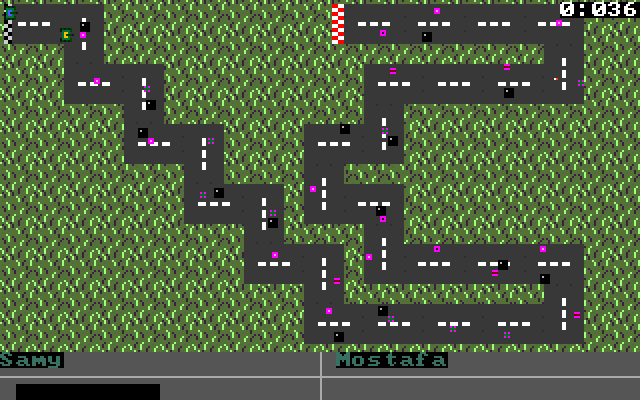
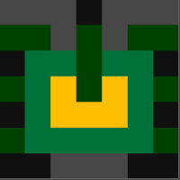
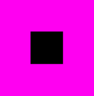
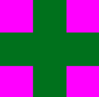

# Hasalney W Kalemny
 

## About the Game

This game is a 2-player racing game implemented using assembly x86 providing two modes: chatting mode and race mode. UART protocol is used for serial communication among two machines

## Game design

### Cars

  

### Power ups

|  |  |  |  |
| ---------------------------------------------------- | ---------------------------------------------- | ---------------------------------------------- | ------------------------------------------------ |
| Create Obstacle                                      | Decrement speed                                | Increment speed                                | Pass Obstacle                                    |

## Run the Game

### Setting up the enviroment

1. Install masm/tasm extension on visual studio
2. Set the dos enviroment as **dosbox MASM-v6.11**

### virtual serial connection

1. Install **Launch virtual serial port driver**
2. Make a pair
3. Choose ports to be **COM1** and **COM2**

### Setting up the configure file

1. Open **dosbox-0.74 conf** file
2. Set `serial1 = directserial realport:COM1`
3. click **ctrl + shift + P** and type **reload window**
4. Go to the **Project.asm** file and search for **PlayerNumber** and set it by 1
5. Right click in the coding area and choose **run asm code**
6. Repeat steps from **2** to **5** with changing **COM1** into **COM2** and **PlayerNumber** to **2**

## Features

- Interface for getting players' names
- Randomized racing track: each time the game runs it gets different track
- Multidirectional cars is used: cars direction changes on stiring
- Random obstacles
- 4 types of power ups
- 2-minute Game timer
- Collisions between Cars are handled

## Bugs in the game

- There is a slight delay between the movement of the cars in the screens of both players

# Contributers

|  |  |  |  |
| ------------------------------------------------------------------------- | ------------------------------------------------------------------------------- | --------------------------------------------------------------------- | -------------------------------------------------------------------- |
| [Abderuhman Samy](https://github.com/AbdelruhmanSamy)                     | [Abd El-Rahman Mostafa](https://github.com/Abdulrahman-Mostafa10)               | [Ashraf Bahy](https://github.com/Ashraf-Bahy)                         | [Eslam Wageh](https://github.com/eslamwageh)                         |
